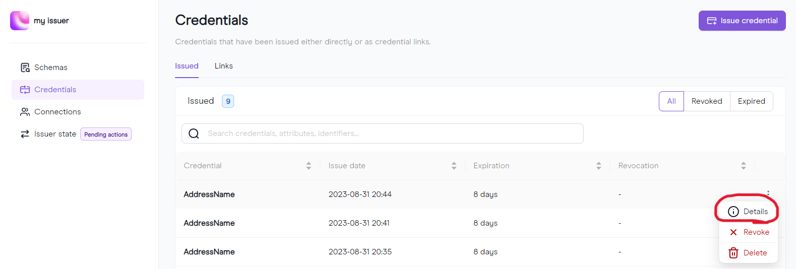
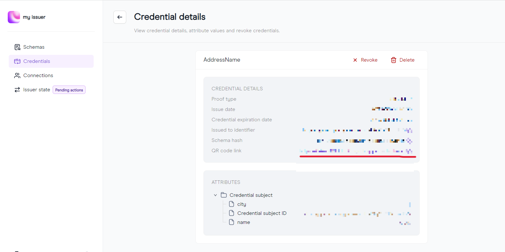
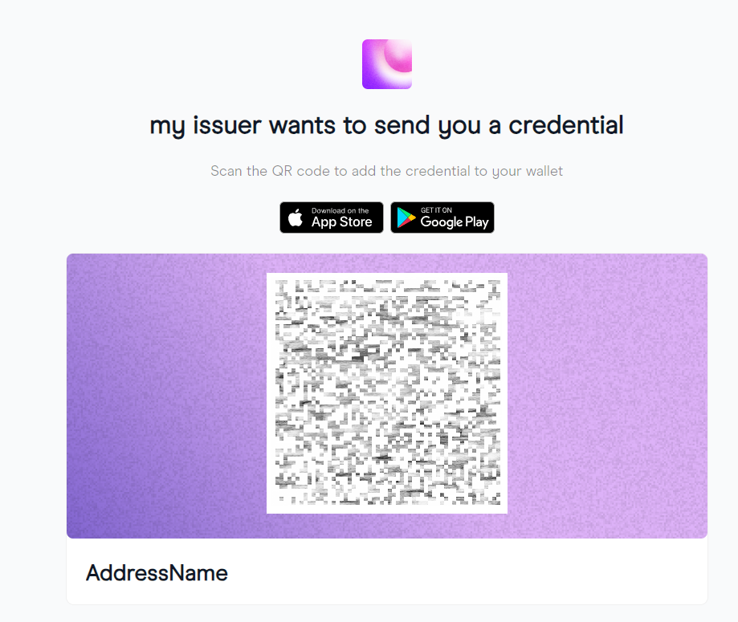
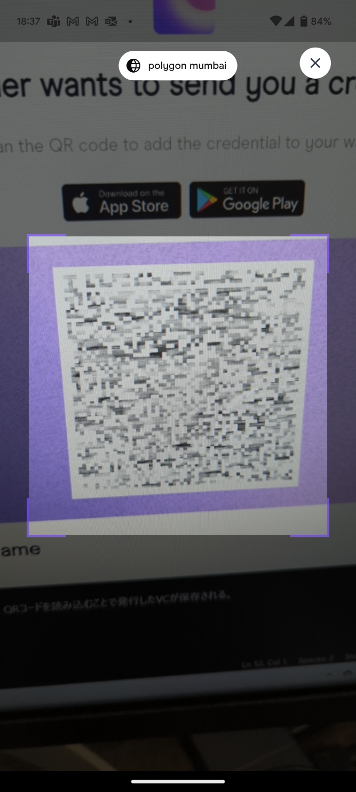

# Polygon IDによるVCの発行
VCの発行に利用したPolygon IDの構築と利用方法について記載する。

今回のデモでは、Polygon IDの以下ツールを利用する。
* VCの発行：Polygon IDの[issuer-node](https://github.com/0xPolygonID/issuer-node/tree/v.2.1.0)のv.2.1.0
* VCの提示：Polygon ID Wallet App ([Google Play](https://play.google.com/store/apps/details?id=com.polygonid.wallet), [App Store](https://apps.apple.com/us/app/polygon-id/id1629870183))


## Issuer-nodeの構築
Issuer-nodeの構築方法は、[Polygon ID Documentation tutorials](https://0xpolygonid.github.io/tutorials/)内の[Setup Guide(Core API)](https://0xpolygonid.github.io/tutorials/issuer/setup-issuer-core/)と[Setup Guide(API UI)](https://0xpolygonid.github.io/tutorials/issuer/setup-issuer-ui/)に記載の通りである。

なお、Polygon ID Wallet AppによるVCの提示を実施するため、UI APIサーバ（localhost:3002）にパブリックURLを付与する必要がある。パブリックURLを付与には、[ngrok](https://ngrok.com/)を利用する。

パブリックURL付与方法は下記の通りである。

1. `.env-api`ファイルの編集

    `.env-api`を以下のように編集する。
    ```
    # ...
    ISSUER_API_UI_SERVER_URL=<ngrokで取得したpublic URL>
    ```

2. ngrokによるforwarding service起動

    起動コマンドは以下の通りである。
    ```
    ./ngrok http --domain <ngrokで取得したpublic URL> 3002; 
    ```

## Issuer-nodeによるVCの発行

### カスタムschemaの作成
今回のデモでは、カスタムschemaを作成し使用する。
カスタムschemaの作成には[Schema builder](https://schema-builder.polygonid.me/)を利用した。
作成したSchemaは、[schema](https://github.com/TeamACombinato/PolygonID/tree/main/schemas)フォルダに格納している。

### VCの発行

VCの発行方法は、[Polygon ID Documentation tutorials](https://0xpolygonid.github.io/tutorials/)内の[Issuer Node UI Guide](https://0xpolygonid.github.io/tutorials/issuer-node/issuer-node-guide/)に記載の通りであり、「Direct Issuance」の方法でVC発行を行う。

### Polygon ID Wallet AppへVCの保存

Issuer Node UIの「Credentials」の「Details」よりCredential発行用の2次元コードを表示する。






Polygon ID Wallet Appを起動し、2次元コードを読み込むことで発行したVCがアプリ内に保存される。


